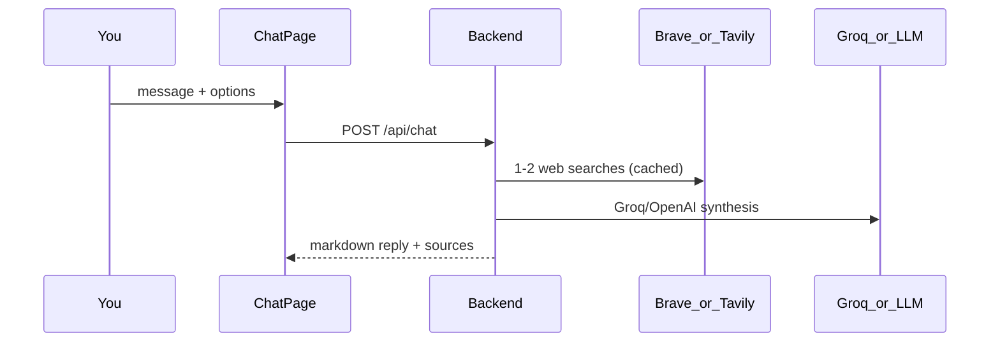

# Sales Manager AI — Chat Guide

How chat works and every option available.

---

## Quick start

1. Sign in at `/login`
2. Type a question or click a **quick-action** chip
3. Optionally set **region**, **constraints**, or **deep research** in the sidebar

---

## What happens when you send a message



Every answer is built from:

1. **Web research** — Brave or Tavily search results (cached in MongoDB)
2. **Synthesis** — Groq (recommended free), OpenAI, Ollama, or template fallback
3. **Conversation history** — last 12 messages for follow-up context

---

## Recommended free stack (Groq + Brave)

Full AI answers at **$0** for typical usage:

1. Sign up at [console.groq.com](https://console.groq.com) and create an API key
2. Sign up at [Brave Search API](https://brave.com/search/api/) for a free search key (~2,000 queries/month)
3. Add to `backend/.env`:

```env
SALES_AI_SYNTHESIS_MODE=auto
GROQ_API_KEY=gsk_your_groq_key
OPENAI_BASE_URL=https://api.groq.com/openai/v1
OPENAI_SALES_AI_MODEL=llama-3.3-70b-versatile

SEARCH_PROVIDER=brave
BRAVE_API_KEY=your_brave_key
SALES_AI_MAX_TAVILY_SEARCHES=2
SEARCH_CACHE_TTL_HOURS=24
```

4. Restart the backend: `npm run dev --prefix backend`

| You ask | What happens |
|---------|--------------|
| "What are gold trends in UAE?" | Brave search (cached) + Groq full answer with sources |
| "What is inflation in Turkey?" | General search query + Groq full answer |
| Groq key missing | Template fallback with setup hint |
| Same question twice | Cache hit — no extra Brave API call |

`SALES_AI_SYNTHESIS_MODE=auto` uses the LLM when `GROQ_API_KEY` or `OPENAI_API_KEY` is set; otherwise template fallback. Set `template` to force template-only (not recommended).

---

## Free / low-cost configuration

Set in `backend/.env` to minimize API spend while keeping full answers:

```env
SALES_AI_SYNTHESIS_MODE=auto
SALES_AI_MAX_TAVILY_SEARCHES=2
SEARCH_CACHE_TTL_HOURS=24
```

| Setting | Free recommendation | Why |
|---------|---------------------|-----|
| `GROQ_API_KEY` | Groq free tier | Full LLM answers at no cost |
| `SALES_AI_SYNTHESIS_MODE` | `auto` or `openai` | LLM when key set; template only as fallback |
| `SALES_AI_MAX_TAVILY_SEARCHES` | `2` (default) | Fewer searches per message |
| `SEARCH_PROVIDER` | `brave` with free Brave API key | ~2,000 free searches/month |
| Deep research checkbox | Off unless needed | Advanced depth costs more on Tavily |
| `SEARCH_CACHE_TTL_HOURS` | `24` | Repeat questions hit MongoDB cache, not the search API |

### Brave Search (free tier alternative)

```env
SEARCH_PROVIDER=brave
BRAVE_API_KEY=your-brave-api-key
```

### Ollama (free local LLM)

```env
SALES_AI_SYNTHESIS_MODE=openai
OPENAI_BASE_URL=http://localhost:11434/v1
OPENAI_API_KEY=ollama
OPENAI_SALES_AI_MODEL=llama3.2
```

---

## Web research

The backend builds **1 query** for simple questions, or **2–4** for complex ones (competitors, regulations, pipeline keywords).

Results are **cached in MongoDB** for 24h by default — identical queries do not call the search API again.

**Providers:** `tavily` (default) or `brave` via `SEARCH_PROVIDER`.

**Limits:** Up to `SALES_AI_MAX_TAVILY_SEARCHES` parallel searches (default 2), 5 results each.

---

## Reply sections

| Section | When shown |
|---------|------------|
| **Answer** | Always — direct response |
| **Recent conversation** | Template mode with prior messages |
| **Market research** | Web summaries + source links |
| **Suggested next steps** | Template mode recommendations |

Source links appear below assistant messages. Assistant replies also show **search count**, **cache hits**, and **provider** when available.

---

## Integrations (server config)

### Web search

- **Tavily:** `SEARCH_PROVIDER=tavily` + `TAVILY_API_KEY`
- **Brave (free tier):** `SEARCH_PROVIDER=brave` + `BRAVE_API_KEY`

### OpenAI, Groq, or compatible LLM

**Groq (recommended free):**

```env
GROQ_API_KEY=gsk_...
OPENAI_BASE_URL=https://api.groq.com/openai/v1
OPENAI_SALES_AI_MODEL=llama-3.3-70b-versatile
SALES_AI_SYNTHESIS_MODE=auto
```

**Paid OpenAI:**

```env
OPENAI_API_KEY=sk-...
SALES_AI_SYNTHESIS_MODE=openai
OPENAI_SALES_AI_MODEL=gpt-4o-mini
```

Falls back to template mode if the LLM fails or no key is configured.

---

## Chat UI options

| Option | Location | Effect |
|--------|----------|--------|
| **Region focus** | Sidebar dropdown | Adds region keywords to Tavily searches |
| **Constraints** | Sidebar text field | Appends extra context to search queries |
| **Deep research** | Sidebar checkbox | Forces advanced Tavily search depth |
| **Quick actions** | Empty chat screen | Pre-built prompts |
| **New chat** | Sidebar button | Clears current conversation |
| **Recent chats** | Sidebar list | Load a saved session |
| **Export** | Top bar | Download chat as markdown |
| **Mode badge** | Sidebar | Shows `Groq`, `OpenAI`, `Ollama`, or `Template (fallback)` |

**Rate limit:** 20 messages per minute per user.

---

## Session history

- Each conversation is saved server-side with a `sessionId`
- **Recent chats** lists your last 20 sessions
- API: `GET /api/chat/sessions`, `GET /api/chat/sessions/:id`

---

## Embed

Generic JWT handoff for iframe embedding:

`https://sales.loopcstrategies.com/embed?token=<jwt>`

---

## Related docs

- [README.md](./README.md) — setup and deploy
- [PROJECT_ANALYSIS.md](./PROJECT_ANALYSIS.md) — full codebase architecture
