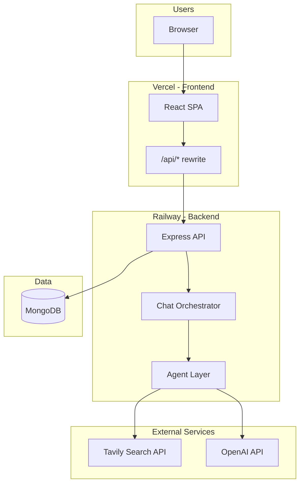

# Sales Manager AI — Complete Project Analysis

## What This Project Is

**Sales Manager AI** is a standalone B2B sales intelligence product for precious metals and jewelry wholesale (gold/silver trends, Central Asia, Middle East markets). Users chat with an AI assistant that:

1. Researches live market data via **Tavily** web search
2. Synthesizes answers using **template-based agents** or **OpenAI** (configurable)

Hosted at `sales.loopcstrategies.com` with optional JWT embed at `/embed?token=<jwt>`.

---

## High-Level Architecture

**Monorepo layout:**

| Path | Role |
|------|------|
| `backend/` | Express API, MongoDB models, AI orchestration |
| `frontend/` | React + Vite SPA |
| `scripts/` | Deployment checklist utility |
| `package.json` | Root workspace scripts (`dev`, `build`, `test`) |
| `vercel.json` | Frontend build + API proxy to Railway |
| `railway.toml` | Backend deploy config |

---

## Tech Stack

### Backend

- Express 4, MongoDB (Mongoose 8), JWT auth, Joi validation
- Tavily web search, OpenAI chat completions (optional)
- Jest + Supertest, default port 5100

### Frontend

- React 18.3, Vite 6, react-router-dom 6
- Plain CSS, React Context state, port 5173

### External APIs

| Service | Purpose | Required? |
|---------|---------|-----------|
| **Tavily** | Web search for market research | Yes (for research) |
| **MongoDB** | User, workspace, chat session storage | Yes |
| **OpenAI** | LLM synthesis | Optional |

---

## API Surface

| Endpoint | Auth | Purpose |
|----------|------|---------|
| `GET /api/health` | No | Health + MongoDB status |
| `POST /api/auth/register` | No | Create user + workspace |
| `POST /api/auth/login` | No | Login |
| `GET /api/auth/me` | Yes | Current user + workspace |
| `GET /api/config` | Yes | AI config, regions, quick actions |
| `POST /api/chat` | Yes | Send message (rate-limited) |
| `GET /api/chat/sessions` | Yes | List last 20 sessions |
| `GET /api/chat/sessions/:id` | Yes | Load session messages |

---

## Chat Orchestration

[`backend/services/orchestrator.js`](backend/services/orchestrator.js):

1. Build Tavily search queries (always runs web research)
2. Run `marketResearchAgent`
3. Synthesize via OpenAI (`openAiStrategyAgent`) or template (`templateStrategyAgent`)
4. Return markdown reply + source sections

Agents in `backend/services/agents/`:

| Agent | Role |
|-------|------|
| `marketResearchAgent.js` | Formats Tavily results + sources |
| `templateStrategyAgent.js` | Template markdown assembly |
| `openAiStrategyAgent.js` | GPT-powered synthesis with research context |

Conversation history (last 12 messages) is passed to synthesis for follow-up context.

---

## Database Models

- **User** — email, name, passwordHash, workspaceId
- **Workspace** — name, ownerId
- **ChatSession** — userId, workspaceId, title, messages[]

---

## Frontend Routes

| Route | Page | Auth |
|-------|------|------|
| `/` | ChatPage | Protected |
| `/login` | LoginPage | Public |
| `/embed` | EmbedPage | Public (JWT handoff) |

Chat sidebar: region, constraints, deep research, session history, synthesis mode badge.

---

## Environment Variables

| Variable | Purpose |
|----------|---------|
| `MONGO_URI` | MongoDB connection |
| `JWT_SECRET` | Required at startup |
| `TAVILY_API_KEY` | Web search |
| `OPENAI_API_KEY` | Optional GPT synthesis |
| `SALES_AI_SYNTHESIS_MODE` | `template` or `openai` |
| `SALES_AI_MAX_TAVILY_SEARCHES` | Max parallel searches (default 4) |
| `CHAT_RATE_LIMIT_MAX` | Chat rate limit (default 20) |

---

## Key File Index

| Area | Path |
|------|------|
| Backend entry | `backend/server.js` |
| Express app | `backend/app.js` |
| Chat orchestrator | `backend/services/orchestrator.js` |
| Agents | `backend/services/agents/` |
| Tavily search | `backend/services/tavilySearch.js` |
| Frontend entry | `frontend/src/main.jsx` |
| Main chat UI | `frontend/src/pages/ChatPage.jsx` |
| API client | `frontend/src/api/client.js` |

---

## Summary

Sales Manager AI is a focused monorepo delivering a sales intelligence chat experience: Tavily web research plus OpenAI or template synthesis. The frontend is a lightweight React SPA with region targeting, research options, and session history. Deployed on Railway (API) + Vercel (UI).

See also [CHAT_GUIDE.md](./CHAT_GUIDE.md) for user-facing chat documentation.
