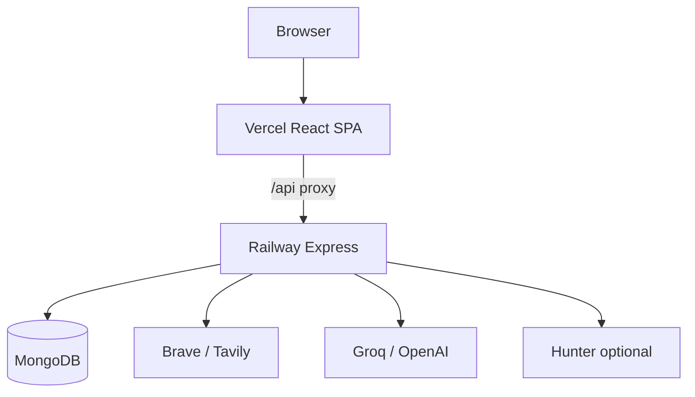

# Sales Manager AI — Project Analysis

**Sales Manager AI** is a B2B sales intelligence + CRM product (jewelry / precious metals and wholesale markets worldwide).

Hosted at `sales.loopcstrategies.com` · API on Railway · UI on Vercel.

---

## Product pillars

1. **Research chat** — Brave/Tavily web research + Groq/OpenAI/template synthesis  
2. **Market dashboard** — news cards, metals prices, optional LLM summaries  
3. **CRM** — Salesforce-style Accounts, Contacts, Leads, Pipeline, Products, Service, Marketing  

---

## Architecture

| Path | Role |
|------|------|
| `backend/` | Express API, Mongoose, AI + CRM services |
| `frontend/` | React + Vite SPA |
| `vercel.json` | UI build + `/api` → Railway |
| `Dockerfile` / `railway.toml` | API container |

---

## CRM highlights

- Workspace-scoped objects (Account, Contact, Lead, Opportunity, …)  
- **Import from web** — company-quality filter + Region tagging + TLD country  
- **Find contacts** — free: Brave/Tavily + Groq; optional **Hunter** only if `HUNTER_API_KEY` (button hidden otherwise)
- Contact `source` (`manual` / `csv` / `web_llm` / `hunter`) + `needsVerify`  
- Home / Analytics: Accounts by **Region** and **Country**  
- Account detail: **Find contacts** (primary), **New Opportunity**; Hunter only if configured

---

## API (selected)

| Prefix | Purpose |
|--------|---------|
| `/api/auth` | register, login, me |
| `/api/chat` | research chat + sessions |
| `/api/dashboard` | market feed |
| `/api/crm/stats` | counts + geo breakdown |
| `/api/crm/prospect/*` | search, import, find-contacts, hunter, geo backfill |
| `/api/{accounts,contacts,leads,...}` | CRM CRUD |

---

## Auth & uploads

- JWT Bearer (`JWT_SECRET` required)  
- `/uploads` requires auth (Bearer or `?token=` for images)  

---

## Local / deploy

See [README.md](./README.md) and [DEPLOYMENT.md](./DEPLOYMENT.md). Chat UX: [CHAT_GUIDE.md](./CHAT_GUIDE.md).
